# Nongkrong Polmed

Web GIS dan aplikasi admin mobile untuk pemetaan tempat nongkrong mahasiswa di sekitar Politeknik Negeri Medan.

## Features

- Pemetaan lokasi tempat nongkrong
- Filter berdasarkan fasilitas
- Informasi kisaran harga
- Visualisasi lokasi menggunakan OpenStreetMap
- Admin mobile untuk pengelolaan data lokasi

## Tech Stack

### Web
- CodeIgniter 4
- PostgreSQL
- PostGIS
- Leaflet
- OpenStreetMap

### Mobile Admin
- Flutter
- Supabase

## Screenshots
### Homepage
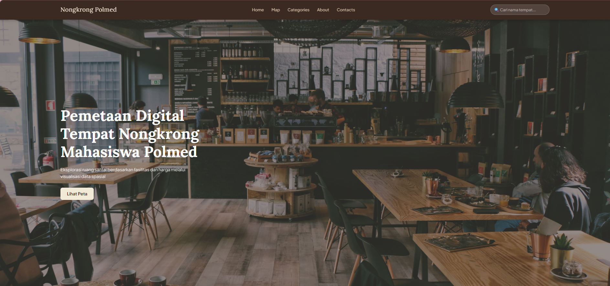
### Daftar Tempat
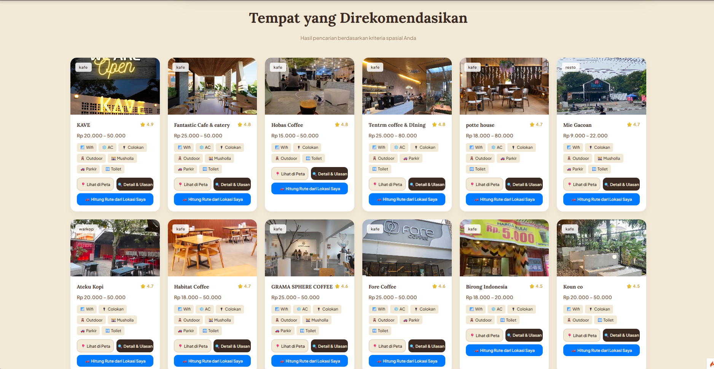
### Detail Tempat
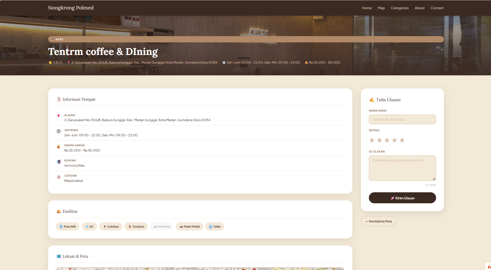
### Map
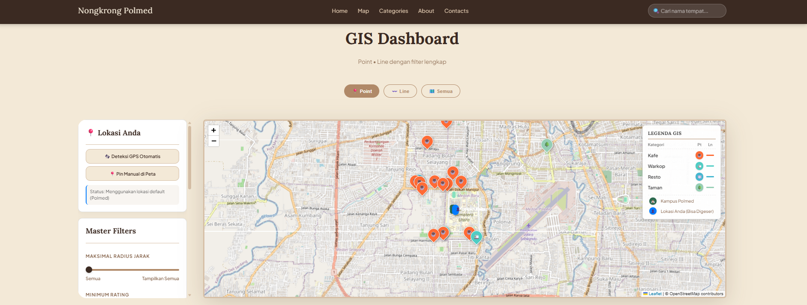
### Category
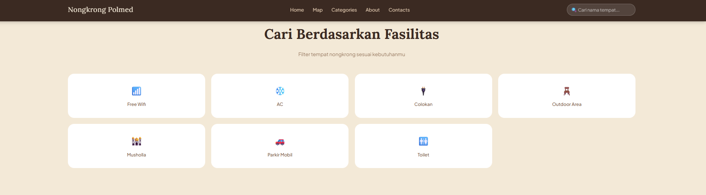
### Contact
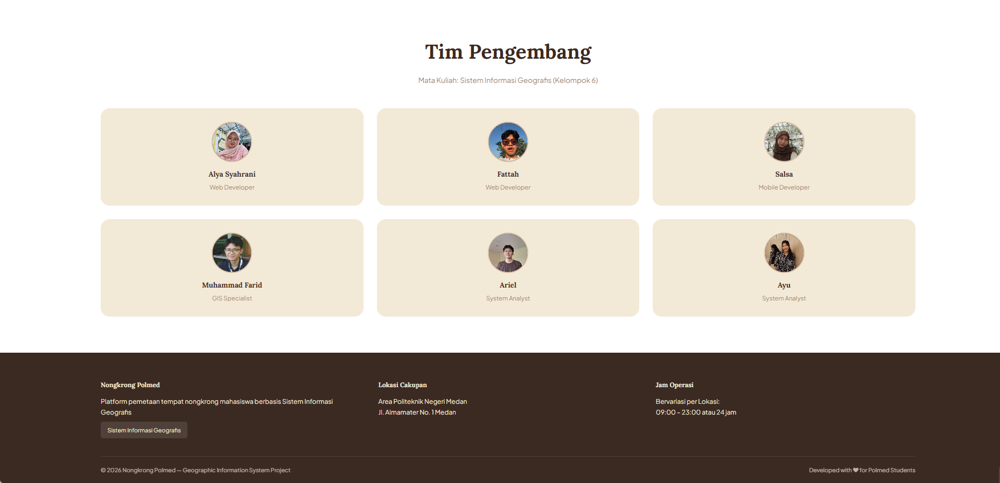
### Login Admin
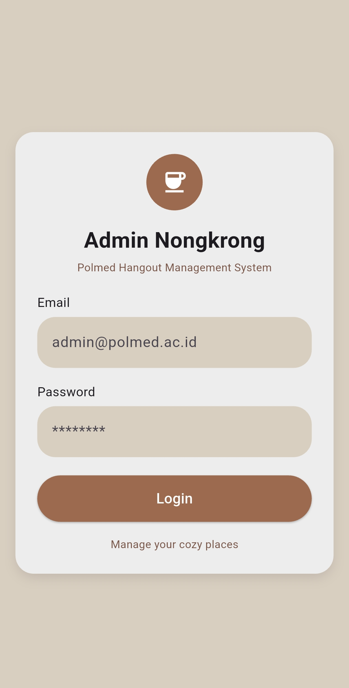
### Admin Dashboard
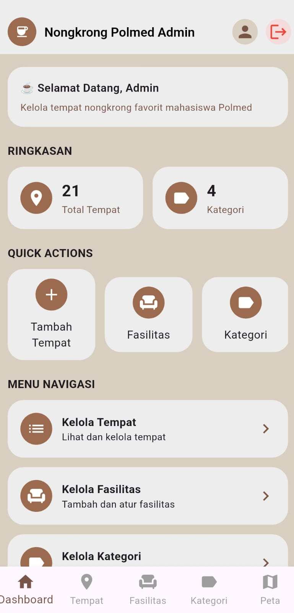
### List Category
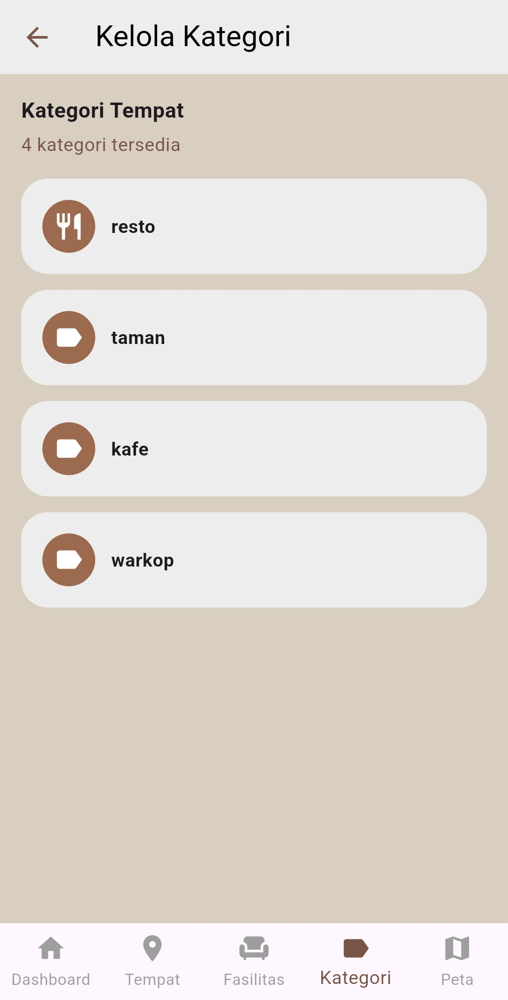
### List Tempat
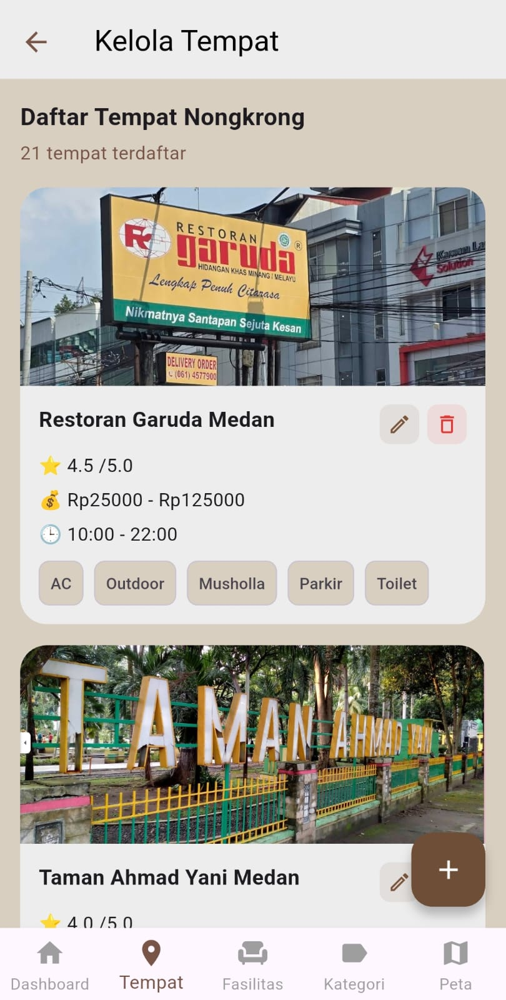
### Form Tambah Tempat
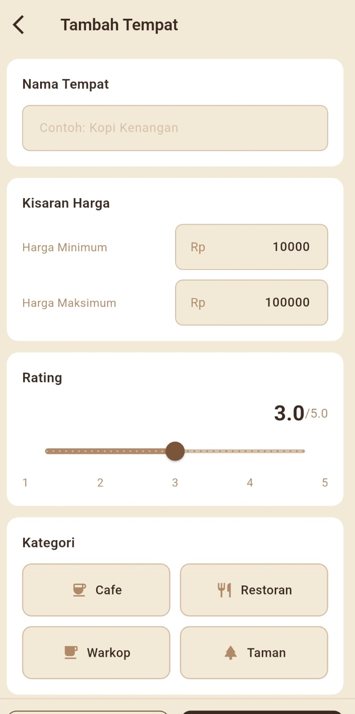
### Map Admin
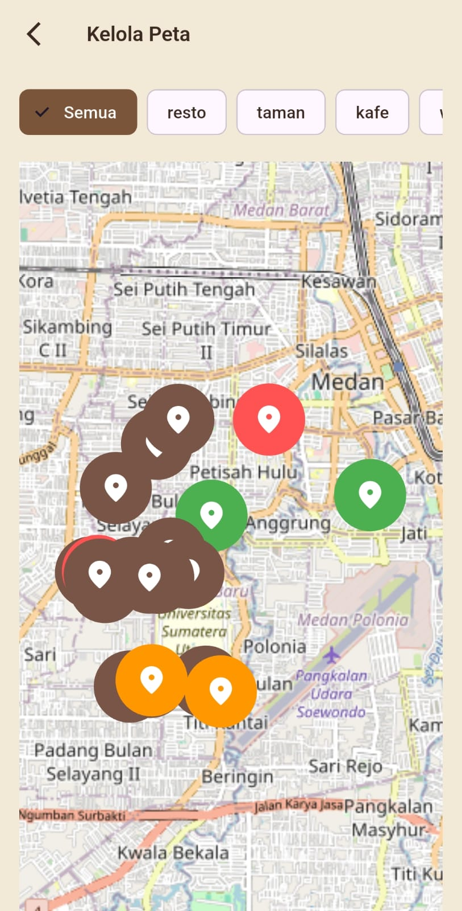

## Team Project

Project ini dikembangkan sebagai project akademik.
